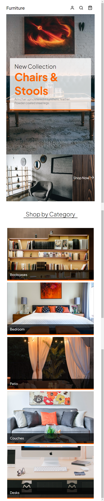

# CSS Grids Activity

## Description

For our lesson activity, I was required to re-create the design of a fictional online furniture store using CSS Grids to achieve a polished, professional-level layout. With the addition of `@media` queries I was able to make the grids responsive to various screen-sizes. 

## Learning Points

Learning about CSS Grids has been very useful and will help in future when building professional front pages for websites. 

The media queries will be especially useful when building responsive layouts and it was a great introduction into how you can change your layout dependant on screen-size.

## Useful Information

The page is deployed on GitHub - [click here](https://rbrd87.github.io/css-grids-activity/)

The repository of the project is also hosted on GitHub - [click here](https://github.com/rbrd87/css-grids-activity)

## Screenshots

The finished website looks professional and polished with a clean modern layout. 
 

  
See screenshot

  
  

 
With the addition of the media queries, the website is responsive to various screen-sizes.
  

  
Mobile example

  
  

 
Here is a snapshot of the html used - all items to go in the CSS grid were given an <code>id</code> for the <code>grid-template-area</code> property to work.
  

  
See HTML example screenshot

  
  

 
Here is a snapshot of the CSS used to create the Category grid on the page.
  

  
See CSS grid screenshot

  
  

 
Here is a snapshot of the media queries implemented on the site to ensure it is responsive to different screen-sizes.
  

  
See CSS media query screenshot

  
  

